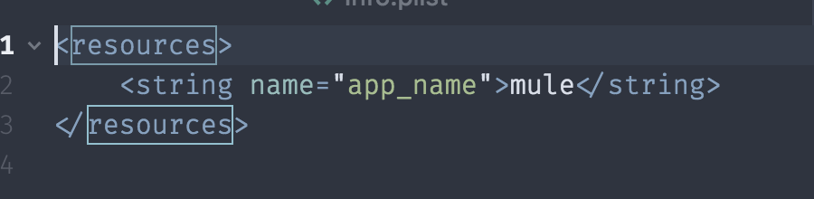

<h1 align="center">
   
  
   
  React Native Checklist
   
</h1>

A check list to refer to before starting a react-native project. All credit goes to Chris Ball as this is heavily based on his [Chain React 2017](https://www.youtube.com/watch?v=W8X7t1qlT_w) talk.

***Disclaimer: This is still a work in progress. If you notice any mistakes, PRs are very appreciated.***

## Table of content

- [Prerequisites](#installation)
  - [App Store](#app-store-account)
- [Init App](#init-app)
  - [Starters](#starters)
- [App Icons & Splash-screen](#app-icons-&-splash-screen)
  - [Automatic](#generate-app-icons-&-splash-screen-automatically)
  - [Manual](#generate-app-icons-&-splash-screen-manually)
- [Rename App](#rename-app)
  - [Automatic](#rename-app-automatically)
  - [Manual](#rename-app-manually)
- [CI](#ci)
  - [Comparison Table](#comparison-table)
- [Handle Offloine](#handle-offline)
  - @TODO
- [Certificates](#Certificates)
  - @TODO
- [Use Fastlane Precheck](#use-fastlane-precheck)
- [Review Apple's Common App Rejections](#review-common-app-rejection)

## Prerequisites
### App Store / Google Play

#### iOS
If you are a company, you will need a [D-U-N-S number](https://developer.apple.com/support/D-U-N-S/).

Check whether you have a D-U-N-S number [here](https://developer.apple.com/enroll/duns-lookup/#/search) . If you don't have one, you will be given the option to apply.

Otherwise, you can sign up as an individual.

#### Android
Google is simpler, however you should still know if you are enrolling as a company or individual.

Sign up 👉 [Google Play](https://play.google.com/apps/publish/signup/).

## Init App
### Starters
There are many boilerplates/starter kits for react-native out there. I highly recommend using [create-react-native-app](https://github.com/react-community/create-react-native-app) as a starting point, however if you do not mind learning the boilerplates, you will find a list of good starters below.

#### [ignite 🔗](https://github.com/infinitered/ignite)
#### [pepperoni-app-kit 🔗](https://github.com/futurice/pepperoni-app-kit)

## App Icons & Splash-screen
### Generate App Icon & Splash-screen Automatically
***💻📲 (Recommended)***

Generating app icons and a splash-screen doesn't have to be hard. Simply install [generator-rn-toolbox](https://github.com/bamlab/generator-rn-toolbox/blob/master/generators/assets/README.md) and follow the instructions to get them for both iOS and Android.

### Generate App Icon & Splash-screen Manually
If you do not go with the automatic way, you will need to generate your app icons in the following sizes for each respective format:

[Original answer](https://stackoverflow.com/a/34333915/6401805)

#### iOS
* In iOS, set `AppIcon` in `Images.xcassets`
* Add 9 different size icons:
  * 29pt
  * 29pt*2
  * 29pt*3
  * 40pt*2
  * 40pt*3
  * 57pt
  * 57pt*2
  * 60pt*2
  * 60pt*3.

#### Android
* Put ic_launcher.png to folder ``[PrjDir]/android/app/src/main/res/minmap-*`.
  * 72*72 `ic_launcher.png` to `mipmap-hdpi`.
  * 48*48 `ic_launcher.png` to `mipmap-mdpi`.
  * 96*96 `ic_launcher.png` to `mipmap-xhdpi`
  * 144*144 `ic_launcher.png` to `mipmap-xxhdpi`

## Rename
### Rename App Automatically
Use [react-native-rename](https://github.com/junedomingo/react-native-rename) to automatically rename your react-native app fro iOS and Android

### Rename App Manually Manual
Renaming a react-native app manually is simple.
#### iOS
The ***app name*** displayed on the iPhone home screen comes from the CFBundleDisplayName (or "Bundle display ***name***") as the human-readable string in Xcode) entry of your iOS app's info.plist.

#### Android
The app name on android comes from AndroidManifest.xml. Check the label attribute of `<application>`

This value is typically referenced as a named variable, defined in strings.xml

## CI

### Comparison Table
#### Legend

✅ : Officially supported.

❌ : Not supported.

🔌 : Community supported or left to developer to integrate

<table>
    <thead>
        <tr>
            <th><strong>Feature</strong></th>
            <th><strong>Buddy Build</strong></th>
            <th><strong>VS Mobile Center</strong></th>
        </tr>
    </thead>
    <tbody>
        <tr>
            <td><strong>Crash Reports</strong></td>
            <td>✅</td>
            <td>✅</td>
        </tr>
        <tr>
            <td><strong>Bug Reports</strong></td>
            <td>✅</td>
            <td>❌</td>
        </tr>
        <tr>
            <td><strong>Instant Replay</strong></td>
            <td>✅</td>
            <td>❌</td>
        </tr>
        <tr>
            <td><strong>Analytics</strong></td>
            <td>❌</td>
            <td>✅</td>
        </tr>
        <tr>
            <td><strong>Deploy to store</strong></td>
            <td>✅</td>
            <td>✅</td>
        </tr>
    </tbody>
</table>

## Certificates
// @TODO

## Use Fastlane Precheck

Make sure to run fastlane's precheck before submitting your app to Apple's app store. From their repo:
>Apple rejects builds for many avoidable metadata issues like including swear words 😮, other companies’ trademarks, or even mentioning an iOS bug 🐛. _fastlane precheck_ takes a lot of the guess work out by scanning your app’s details in iTunes Connect for avoidable problems. fastlane precheck helps you get your app through app review without rejections so you can ship faster 🚀

[👉 👉Precheck👈 👈](https://github.com/fastlane/fastlane/tree/master/precheck)

## Common App Rejection

Make sure to read over Apple's common app rejection before submitting to the app store. These are the most common issues that apple rejects apps for, so save yourself the trouble and make sure your app won't be rejected for obvious reasons.

👉 👉 [Apple Common Rejection 👈 👈](https://developer.apple.com/app-store/review/rejections/)
